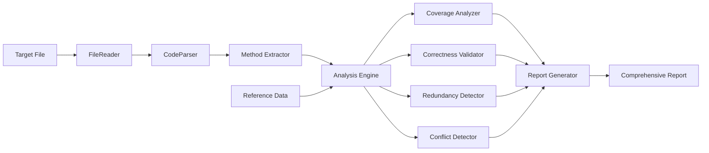

# 设计文档

## 概述

数组示例审查系统是一个静态分析工具，用于评估 JavaScript Array 方法示例文件的质量。系统通过解析目标文件、对比 MDN 参考标准、执行多维度分析，最终生成包含具体改进建议的综合报告。

系统采用模块化设计，将文件解析、方法提取、对比分析、报告生成等功能分离为独立组件，确保可维护性和可扩展性。

## 架构

系统采用管道式架构，数据流经以下阶段：

```
输入文件 → 文件解析器 → 方法提取器 → 参考数据 → 分析引擎 → 报告生成器 → 输出报告
```

### 核心组件

1. **FileReader**: 读取目标文件内容
2. **CodeParser**: 解析 JavaScript 代码，提取方法示例
3. **ReferenceData**: 维护 MDN Array 方法的完整参考列表
4. **AnalysisEngine**: 执行覆盖率、正确性、冗余和冲突分析
5. **ReportGenerator**: 生成格式化的审查报告

### 数据流



## 组件和接口

### 1. FileReader

**职责**: 读取目标文件内容

**接口**:
```javascript
class FileReader {
  /**
   * 读取文件内容
   * @param {string} filePath - 文件路径
   * @returns {Promise<string>} 文件内容
   * @throws {Error} 当文件不存在或无法读取时
   */
  async readFile(filePath)
}
```

### 2. CodeParser

**职责**: 解析 JavaScript 代码，识别 Array 方法的使用

**接口**:
```javascript
class CodeParser {
  /**
   * 解析代码并提取方法信息
   * @param {string} code - JavaScript 代码
   * @returns {ParsedCode} 解析结果
   */
  parse(code)
}

// 返回类型
interface ParsedCode {
  methods: MethodUsage[];      // 发现的方法使用
  comments: Comment[];         // 代码注释
  sections: Section[];         // 代码分区
}

interface MethodUsage {
  name: string;                // 方法名（如 'map', 'filter'）
  type: 'instance' | 'static'; // 方法类型
  lineNumber: number;          // 行号
  code: string;                // 示例代码
  esVersion: string | null;    // ES 版本标注
  comments: string[];          // 相关注释
}
```

### 3. ReferenceData

**职责**: 提供 MDN Array 方法的参考数据

**接口**:
```javascript
class ReferenceData {
  /**
   * 获取所有实例方法
   * @returns {MethodReference[]} 实例方法列表
   */
  getInstanceMethods()
  
  /**
   * 获取所有静态方法
   * @returns {MethodReference[]} 静态方法列表
   */
  getStaticMethods()
  
  /**
   * 获取特定方法的详细信息
   * @param {string} methodName - 方法名
   * @returns {MethodReference | null} 方法详情
   */
  getMethodInfo(methodName)
}

interface MethodReference {
  name: string;                // 方法名
  type: 'instance' | 'static'; // 方法类型
  esVersion: string;           // ES 版本
  importance: 'high' | 'medium' | 'low'; // 重要性
  description: string;         // 简短描述
  mutating: boolean;           // 是否修改原数组
}
```

**参考数据内容**:

实例方法（Instance Methods）:
- at() - ES2022 - medium
- concat() - ES3 - high
- copyWithin() - ES6 - low
- entries() - ES6 - medium
- every() - ES5 - high
- fill() - ES6 - medium
- filter() - ES5 - high
- find() - ES6 - high
- findIndex() - ES6 - high
- findLast() - ES2023 - medium
- findLastIndex() - ES2023 - medium
- flat() - ES2019 - high
- flatMap() - ES2019 - high
- forEach() - ES5 - high
- includes() - ES2016 - high
- indexOf() - ES5 - high
- join() - ES1 - high
- keys() - ES6 - low
- lastIndexOf() - ES5 - medium
- map() - ES5 - high
- pop() - ES3 - high
- push() - ES3 - high
- reduce() - ES5 - high
- reduceRight() - ES5 - medium
- reverse() - ES1 - high
- shift() - ES3 - high
- slice() - ES3 - high
- some() - ES5 - high
- sort() - ES1 - high
- splice() - ES3 - high
- toLocaleString() - ES3 - low
- toReversed() - ES2023 - medium
- toSorted() - ES2023 - medium
- toSpliced() - ES2023 - medium
- toString() - ES1 - low
- unshift() - ES3 - high
- values() - ES6 - low
- with() - ES2023 - medium
- [Symbol.iterator]() - ES6 - low

静态方法（Static Methods）:
- Array.from() - ES6 - high
- Array.fromAsync() - ES2024 - low
- Array.isArray() - ES5 - high
- Array.of() - ES6 - high

### 4. AnalysisEngine

**职责**: 协调各种分析器执行分析

**接口**:
```javascript
class AnalysisEngine {
  constructor(parsedCode, referenceData)
  
  /**
   * 执行完整分析
   * @returns {AnalysisResult} 分析结果
   */
  analyze()
}

interface AnalysisResult {
  coverage: CoverageReport;
  correctness: CorrectnessReport;
  redundancy: RedundancyReport;
  conflicts: ConflictReport;
}
```

### 5. CoverageAnalyzer

**职责**: 分析方法覆盖情况

**接口**:
```javascript
class CoverageAnalyzer {
  /**
   * 分析覆盖率
   * @param {MethodUsage[]} foundMethods - 文件中发现的方法
   * @param {MethodReference[]} referenceMethods - 参考方法列表
   * @returns {CoverageReport} 覆盖率报告
   */
  analyze(foundMethods, referenceMethods)
}

interface CoverageReport {
  totalMethods: number;           // 总方法数
  coveredMethods: string[];       // 已覆盖的方法
  missingMethods: string[];       // 缺失的方法
  coveragePercentage: number;     // 覆盖率百分比
  missingByImportance: {          // 按重要性分组的缺失方法
    high: string[];
    medium: string[];
    low: string[];
  };
  byType: {                       // 按类型分组
    instance: {
      total: number;
      covered: number;
      missing: string[];
    };
    static: {
      total: number;
      covered: number;
      missing: string[];
    };
  };
}
```

### 6. CorrectnessValidator

**职责**: 验证示例代码的正确性

**接口**:
```javascript
class CorrectnessValidator {
  /**
   * 验证方法使用的正确性
   * @param {MethodUsage[]} methods - 方法使用列表
   * @param {ReferenceData} referenceData - 参考数据
   * @returns {CorrectnessReport} 正确性报告
   */
  validate(methods, referenceData)
}

interface CorrectnessReport {
  issues: CorrectnessIssue[];     // 发现的问题
  totalIssues: number;            // 问题总数
  byCategory: {                   // 按类别分组
    esVersion: number;            // ES 版本标注错误
    syntax: number;               // 语法问题
    usage: number;                // 用法问题
    comment: number;              // 注释问题
  };
}

interface CorrectnessIssue {
  method: string;                 // 方法名
  lineNumber: number;             // 行号
  category: 'esVersion' | 'syntax' | 'usage' | 'comment';
  severity: 'error' | 'warning';  // 严重程度
  message: string;                // 问题描述
  suggestion: string;             // 修正建议
}
```

**验证规则**:
1. ES 版本标注准确性：对比 ReferenceData 中的版本信息
2. 方法参数合理性：检查参数数量和类型
3. 典型用法展示：确保示例展示了方法的常见用例
4. 注释与代码一致性：验证注释描述与代码行为匹配

### 7. RedundancyDetector

**职责**: 检测冗余和重复内容

**接口**:
```javascript
class RedundancyDetector {
  /**
   * 检测冗余内容
   * @param {MethodUsage[]} methods - 方法使用列表
   * @returns {RedundancyReport} 冗余报告
   */
  detect(methods)
}

interface RedundancyReport {
  redundancies: Redundancy[];     // 发现的冗余
  totalRedundancies: number;      // 冗余总数
}

interface Redundancy {
  method: string;                 // 方法名
  occurrences: number;            // 出现次数
  lineNumbers: number[];          // 所有出现的行号
  similarity: number;             // 相似度 (0-1)
  suggestion: string;             // 简化建议
}
```

**检测策略**:
1. 同一方法的多个示例：计算代码相似度
2. 功能重复的代码块：识别实现相同功能的不同写法
3. 评估独特价值：判断每个示例是否提供新的学习价值

### 8. ConflictDetector

**职责**: 检测矛盾和不一致

**接口**:
```javascript
class ConflictDetector {
  /**
   * 检测冲突内容
   * @param {MethodUsage[]} methods - 方法使用列表
   * @param {ReferenceData} referenceData - 参考数据
   * @returns {ConflictReport} 冲突报告
   */
  detect(methods, referenceData)
}

interface ConflictReport {
  conflicts: Conflict[];          // 发现的冲突
  totalConflicts: number;         // 冲突总数
}

interface Conflict {
  method: string;                 // 方法名
  type: 'esVersion' | 'description' | 'behavior';
  locations: number[];            // 冲突位置（行号）
  description: string;            // 冲突描述
  resolution: string;             // 解决建议
}
```

**检测类型**:
1. ES 版本不一致：同一方法的不同版本标注
2. 说明矛盾：不同注释对同一方法的描述不一致
3. 代码与注释不匹配：示例行为与注释说明不符

### 9. ReportGenerator

**职责**: 生成格式化的综合报告

**接口**:
```javascript
class ReportGenerator {
  /**
   * 生成综合报告
   * @param {AnalysisResult} analysisResult - 分析结果
   * @returns {string} 格式化的报告文本
   */
  generate(analysisResult)
  
  /**
   * 生成改进建议
   * @param {AnalysisResult} analysisResult - 分析结果
   * @returns {Recommendation[]} 改进建议列表
   */
  generateRecommendations(analysisResult)
}

interface Recommendation {
  priority: 'high' | 'medium' | 'low';
  category: string;               // 类别（覆盖率、正确性等）
  title: string;                  // 建议标题
  description: string;            // 详细描述
  actionItems: string[];          // 具体行动项
}
```

**报告格式**:
```markdown
# Array 示例审查报告

## 执行摘要
- 总体评分: X/100
- 覆盖率: X%
- 发现的问题: X 个
- 改进建议: X 条

## 1. 覆盖率分析
### 1.1 总体覆盖情况
- 已覆盖: X/Y 方法 (Z%)
- 缺失: N 个方法

### 1.2 按类型分组
- 实例方法: X/Y (Z%)
- 静态方法: X/Y (Z%)

### 1.3 缺失的重要方法
[列表]

## 2. 正确性分析
### 2.1 发现的问题
[问题列表，按严重程度排序]

### 2.2 按类别统计
- ES 版本错误: X 个
- 语法问题: X 个
- 用法问题: X 个

## 3. 冗余分析
[冗余内容列表]

## 4. 冲突分析
[冲突列表]

## 5. 改进建议
### 5.1 高优先级
[建议列表]

### 5.2 中优先级
[建议列表]

### 5.3 低优先级
[建议列表]

## 6. 详细发现
[详细的问题和建议]
```

## 数据模型

### 核心数据结构

```javascript
// 方法使用记录
class MethodUsage {
  constructor(name, type, lineNumber, code, esVersion, comments) {
    this.name = name;              // 方法名
    this.type = type;              // 'instance' | 'static'
    this.lineNumber = lineNumber;  // 行号
    this.code = code;              // 代码片段
    this.esVersion = esVersion;    // ES 版本标注
    this.comments = comments;      // 相关注释
  }
}

// 方法参考信息
class MethodReference {
  constructor(name, type, esVersion, importance, description, mutating) {
    this.name = name;
    this.type = type;
    this.esVersion = esVersion;
    this.importance = importance;  // 'high' | 'medium' | 'low'
    this.description = description;
    this.mutating = mutating;      // 是否修改原数组
  }
}

// 分析结果
class AnalysisResult {
  constructor(coverage, correctness, redundancy, conflicts) {
    this.coverage = coverage;
    this.correctness = correctness;
    this.redundancy = redundancy;
    this.conflicts = conflicts;
  }
}
```

## 正确性属性


*属性是一个特征或行为，应该在系统的所有有效执行中保持为真——本质上是关于系统应该做什么的形式化陈述。属性作为人类可读规范和机器可验证的正确性保证之间的桥梁。*

### 文件读取属性

**属性 1: 文件内容完整读取**
*对于任何* 存在的文件路径，读取操作应该返回与文件实际内容完全匹配的字符串
**验证需求: 1.1**

**属性 2: 不存在文件的错误处理**
*对于任何* 不存在的文件路径，读取操作应该抛出或返回包含明确错误信息的错误对象
**验证需求: 1.2**

### 代码解析属性

**属性 3: 方法提取完整性**
*对于任何* 包含 Array 方法调用的 JavaScript 代码，解析器应该提取所有方法名称，不遗漏任何一个
**验证需求: 1.3**

**属性 4: ES 版本标注提取**
*对于任何* 包含 ES 版本标注注释的代码，解析器应该正确提取并关联到相应的方法
**验证需求: 1.4**

**属性 5: 代码和注释关联**
*对于任何* 方法示例，解析器应该提取完整的代码片段和相关注释
**验证需求: 1.5**

### 参考数据属性

**属性 6: 参考数据完整性**
*对于任何* MDN 文档中列出的 Array 方法（实例方法和静态方法），参考数据都应该包含该方法的记录
**验证需求: 2.1, 2.2**

**属性 7: 方法元数据完整性**
*对于任何* 参考数据中的方法，都应该包含 ES 版本、类型（实例/静态）和重要性级别信息
**验证需求: 2.3, 2.4, 2.5**

### 覆盖率分析属性

**属性 8: 报告生成完整性**
*对于任何* 完成的分析，系统应该生成包含覆盖率、正确性、冗余和冲突四个子报告的完整分析结果
**验证需求: 3.1, 5.1, 6.1**

**属性 9: 覆盖率计算正确性**
*对于任何* 方法集合，覆盖率百分比应该等于 (已覆盖方法数 / 总方法数) × 100
**验证需求: 3.4**

**属性 10: 覆盖率报告结构完整性**
*对于任何* 覆盖率报告，都应该包含已覆盖方法列表、缺失方法列表、按类型分组的统计数据和按重要性分组的缺失方法
**验证需求: 3.2, 3.3, 3.5, 3.6**

### 正确性验证属性

**属性 11: ES 版本验证**
*对于任何* 带有 ES 版本标注的方法，如果标注与参考数据不一致，验证器应该在正确性报告中记录该问题
**验证需求: 4.4**

**属性 12: 错误记录完整性**
*对于任何* 检测到的正确性问题，报告应该包含方法名、行号、问题类别、严重程度和修正建议
**验证需求: 4.6**

**属性 13: 语法验证**
*对于任何* 包含语法错误的代码示例，验证器应该识别并报告该错误
**验证需求: 4.1**

**属性 14: 参数验证**
*对于任何* 方法调用，如果参数数量或类型明显不符合规范，验证器应该报告该问题
**验证需求: 4.2**

### 冗余检测属性

**属性 15: 重复方法检测**
*对于任何* 在代码中出现多次的方法，如果示例相似度超过阈值，冗余检测器应该识别并报告
**验证需求: 5.2, 5.3**

**属性 16: 冗余报告建议完整性**
*对于任何* 检测到的冗余，报告应该包含合并或删除的具体建议
**验证需求: 5.5**

### 冲突检测属性

**属性 17: ES 版本一致性检测**
*对于任何* 方法，如果在代码中有多处不同的 ES 版本标注，冲突检测器应该识别并报告该不一致
**验证需求: 6.3**

**属性 18: 代码注释一致性检测**
*对于任何* 方法示例，如果代码行为与注释说明不匹配，冲突检测器应该识别并报告
**验证需求: 6.4**

**属性 19: 冲突报告结构完整性**
*对于任何* 冲突报告，都应该包含所有发现的冲突、冲突类型、位置和解决建议
**验证需求: 6.5**

### 建议生成属性

**属性 20: 问题建议映射**
*对于任何* 发现的问题（缺失方法、正确性错误、冗余、冲突），系统都应该生成相应的改进建议
**验证需求: 7.1, 7.2, 7.3, 7.4**

**属性 21: 建议优先级排序**
*对于任何* 建议列表，所有建议都应该有优先级标记（高/中/低），且列表应该按优先级排序
**验证需求: 7.6**

### 综合报告属性

**属性 22: 综合报告结构完整性**
*对于任何* 综合报告，都应该包含执行摘要、所有子报告内容、详细发现列表、优先级排序的行动项和统计数据
**验证需求: 8.1, 8.2, 8.3, 8.4, 8.6**

## 错误处理

### 文件读取错误
- **文件不存在**: 返回清晰的错误消息，指明文件路径
- **权限不足**: 返回权限错误消息
- **文件过大**: 可选择性地限制文件大小，返回适当警告

### 解析错误
- **无效 JavaScript**: 尝试容错解析，记录无法解析的部分
- **编码问题**: 尝试多种编码方式，记录编码问题
- **格式异常**: 记录格式问题但继续分析可解析部分

### 分析错误
- **参考数据缺失**: 使用默认值或跳过该方法的验证
- **意外的方法名**: 记录未知方法但不中断分析
- **数据不一致**: 记录不一致但继续生成报告

### 错误恢复策略
系统采用"尽力而为"策略：
1. 遇到错误时记录但不中断整个流程
2. 部分失败不影响其他部分的分析
3. 最终报告包含所有错误和警告信息
4. 提供详细的错误上下文帮助调试

## 测试策略

### 双重测试方法

系统将采用单元测试和基于属性的测试相结合的方法：

**单元测试**用于：
- 特定的示例场景（如解析包含 map 和 filter 的代码）
- 边缘情况（如空文件、只有注释的文件）
- 错误条件（如文件不存在、无效 JavaScript）
- 集成点（如组件之间的数据传递）

**基于属性的测试**用于：
- 验证上述 22 个正确性属性
- 通过随机生成测试输入覆盖广泛的场景
- 每个属性测试至少运行 100 次迭代

### 基于属性的测试配置

**测试库选择**: 根据实现语言选择：
- JavaScript/TypeScript: fast-check
- Python: Hypothesis
- Java: jqwik

**测试配置**:
- 最小迭代次数: 100 次/属性
- 每个测试标记格式: `Feature: array-examples-audit, Property {N}: {property_text}`
- 失败时保存反例用于回归测试

### 测试数据生成策略

**代码生成器**:
- 生成包含不同 Array 方法的有效 JavaScript 代码
- 生成带有各种 ES 版本标注的注释
- 生成有意的错误代码（用于测试错误检测）
- 生成冗余和冲突的示例（用于测试检测器）

**参考数据生成器**:
- 基于真实 MDN 数据的子集
- 包含各种重要性级别的方法
- 包含实例方法和静态方法

**文件系统模拟**:
- 模拟存在和不存在的文件
- 模拟各种文件内容
- 模拟文件系统错误

### 单元测试覆盖重点

1. **FileReader 测试**
   - 读取存在的文件
   - 处理不存在的文件
   - 处理空文件
   - 处理大文件

2. **CodeParser 测试**
   - 解析包含单个方法的代码
   - 解析包含多个方法的代码
   - 解析带有 ES 版本标注的代码
   - 解析无效 JavaScript
   - 提取注释和代码的关联

3. **ReferenceData 测试**
   - 验证包含所有 MDN 方法
   - 验证方法元数据完整性
   - 查询特定方法信息

4. **CoverageAnalyzer 测试**
   - 100% 覆盖率场景
   - 0% 覆盖率场景
   - 部分覆盖率场景
   - 按类型分组的正确性

5. **CorrectnessValidator 测试**
   - 检测 ES 版本错误
   - 检测语法错误
   - 检测参数错误
   - 正确代码不报错

6. **RedundancyDetector 测试**
   - 检测完全相同的示例
   - 检测高度相似的示例
   - 不误报不同的示例

7. **ConflictDetector 测试**
   - 检测版本标注冲突
   - 检测说明冲突
   - 检测代码与注释不匹配

8. **ReportGenerator 测试**
   - 生成完整报告结构
   - 正确格式化各种数据
   - 生成优先级排序的建议

### 集成测试

**端到端测试场景**:
1. 分析真实的 demo/03-arrays.js 文件
2. 分析故意包含错误的测试文件
3. 分析最小化的示例文件
4. 分析空文件或无效文件

**预期输出验证**:
- 报告包含所有必需部分
- 统计数据准确
- 建议合理且可操作
- 错误处理正确

### 测试优先级

**高优先级**（必须通过）:
- 属性 1-7（文件读取、解析、参考数据）
- 属性 8-10（覆盖率分析）
- 属性 22（综合报告）

**中优先级**（应该通过）:
- 属性 11-14（正确性验证）
- 属性 20-21（建议生成）

**低优先级**（可以后续完善）:
- 属性 15-19（冗余和冲突检测）

## 性能考虑

### 预期性能指标
- 文件读取: < 100ms（对于 < 1MB 文件）
- 代码解析: < 500ms（对于 < 1000 行代码）
- 完整分析: < 2 秒（对于典型示例文件）
- 报告生成: < 100ms

### 优化策略
- 使用流式解析处理大文件
- 缓存参考数据避免重复加载
- 并行执行独立的分析器
- 延迟生成详细报告直到需要时

### 可扩展性
系统设计支持：
- 分析多个文件（批处理模式）
- 添加新的分析器（插件架构）
- 自定义报告格式
- 集成到 CI/CD 流程

## 实现注意事项

### 代码组织
- 每个组件独立的模块/文件
- 清晰的接口定义
- 最小化组件间依赖
- 使用依赖注入便于测试

### 配置管理
- 可配置的重要性阈值
- 可配置的相似度阈值
- 可配置的报告格式
- 可配置的输出详细程度

### 文档要求
- 每个公共接口的 JSDoc/文档注释
- README 包含使用示例
- 设计决策的内联注释
- 测试用例的说明注释

### 代码质量
- 使用 linter（ESLint/Pylint）
- 使用格式化工具（Prettier/Black）
- 类型检查（TypeScript/mypy）
- 代码审查流程
