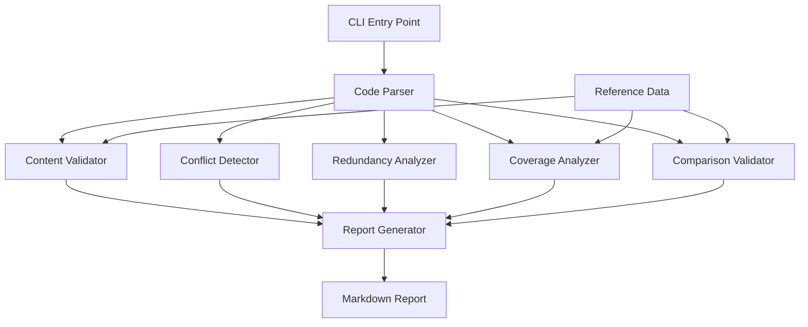

# Design Document

## Overview

The JavaScript Fundamentals Review System is a Python-based static analysis tool that validates educational demo files against official documentation. The system uses a modular architecture with five core analysis components (Content Validator, Conflict Detector, Redundancy Analyzer, Coverage Analyzer, and Comparison Validator) that process demo files and generate a comprehensive review report.

The system operates as a command-line tool that reads two input files (01-variables.js and 01-variables-ts-comparison.ts), performs parallel analysis across all components, and outputs a structured Markdown report with findings and recommendations.

## Architecture



The architecture follows a pipeline pattern where:
1. Code Parser extracts structured data from demo files
2. Five analysis components process the parsed data independently
3. Report Generator aggregates findings and produces output

## Components and Interfaces

### 1. Code Parser

**Purpose**: Extract structured information from JavaScript/TypeScript demo files

**Interface**:
```python
class CodeParser:
    def parse_file(self, file_path: str) -> ParsedFile:
        """Parse a demo file and extract structured content"""
        pass
    
    def extract_comments(self, content: str) -> List[Comment]:
        """Extract all comments with line numbers"""
        pass
    
    def extract_code_blocks(self, content: str) -> List[CodeBlock]:
        """Extract code examples with context"""
        pass
    
    def extract_concepts(self, parsed_file: ParsedFile) -> List[Concept]:
        """Identify concepts being taught (var, let, const, types, etc.)"""
        pass
```

**Data Structures**:
```python
@dataclass
class Comment:
    line_number: int
    text: str
    type: str  # 'single', 'multi', 'section'

@dataclass
class CodeBlock:
    start_line: int
    end_line: int
    code: str
    language: str  # 'javascript' or 'typescript'

@dataclass
class Concept:
    name: str  # 'var', 'let', 'const', 'string', 'number', etc.
    line_number: int
    explanation: str
    code_examples: List[CodeBlock]

@dataclass
class ParsedFile:
    file_path: str
    comments: List[Comment]
    code_blocks: List[CodeBlock]
    concepts: List[Concept]
```

### 2. Reference Data

**Purpose**: Provide structured official documentation data for validation

**Interface**:
```python
class ReferenceData:
    def get_variable_declaration_spec(self, var_type: str) -> VariableSpec:
        """Get official spec for var, let, or const"""
        pass
    
    def get_data_type_spec(self, type_name: str) -> DataTypeSpec:
        """Get official spec for primitive data types"""
        pass
    
    def get_typescript_feature_spec(self, feature: str) -> TypeScriptFeatureSpec:
        """Get official TypeScript feature documentation"""
        pass
```

**Data Structures**:
```python
@dataclass
class VariableSpec:
    name: str  # 'var', 'let', 'const'
    scope: str  # 'function', 'block'
    hoisting: bool
    reassignable: bool
    redeclarable: bool
    temporal_dead_zone: bool
    source_url: str

@dataclass
class DataTypeSpec:
    name: str  # 'String', 'Number', etc.
    typeof_result: str
    description: str
    special_values: List[str]
    pitfalls: List[str]
    source_url: str

@dataclass
class TypeScriptFeatureSpec:
    name: str
    description: str
    syntax_example: str
    pitfalls: List[str]
    source_url: str
```

### 3. Content Validator

**Purpose**: Verify demo file content against official documentation

**Interface**:
```python
class ContentValidator:
    def __init__(self, reference_data: ReferenceData):
        self.reference_data = reference_data
    
    def validate_file(self, parsed_file: ParsedFile) -> ValidationReport:
        """Validate all content in a file"""
        pass
    
    def validate_concept(self, concept: Concept) -> List[ValidationFinding]:
        """Validate a single concept against reference data"""
        pass
```

**Data Structures**:
```python
@dataclass
class ValidationFinding:
    concept: str
    line_number: int
    status: str  # 'accurate', 'inaccurate', 'missing_reference'
    demo_content: str
    reference_content: str
    discrepancy: Optional[str]
    source_url: str

@dataclass
class ValidationReport:
    file_path: str
    findings: List[ValidationFinding]
    accuracy_score: float  # 0.0 to 1.0
```

### 4. Conflict Detector

**Purpose**: Identify contradictory information between files

**Interface**:
```python
class ConflictDetector:
    def detect_conflicts(self, file1: ParsedFile, file2: ParsedFile) -> ConflictReport:
        """Find conflicts between two files"""
        pass
    
    def compare_concepts(self, concept1: Concept, concept2: Concept) -> Optional[Conflict]:
        """Compare explanations of the same concept"""
        pass
```

**Data Structures**:
```python
@dataclass
class Conflict:
    concept: str
    file1_line: int
    file2_line: int
    file1_content: str
    file2_content: str
    conflict_type: str  # 'contradiction', 'inconsistency'
    severity: str  # 'high', 'medium', 'low'

@dataclass
class ConflictReport:
    conflicts: List[Conflict]
    conflict_count: int
```

### 5. Redundancy Analyzer

**Purpose**: Find duplicate or unnecessary content

**Interface**:
```python
class RedundancyAnalyzer:
    def analyze_redundancy(self, file1: ParsedFile, file2: ParsedFile) -> RedundancyReport:
        """Find redundant content between files"""
        pass
    
    def calculate_similarity(self, text1: str, text2: str) -> float:
        """Calculate text similarity (0.0 to 1.0)"""
        pass
```

**Data Structures**:
```python
@dataclass
class RedundantContent:
    concept: str
    file1_lines: Tuple[int, int]
    file2_lines: Tuple[int, int]
    similarity_score: float
    content_type: str  # 'explanation', 'code', 'comment'
    recommendation: str

@dataclass
class RedundancyReport:
    redundant_items: List[RedundantContent]
    overall_redundancy_score: float
```

### 6. Coverage Analyzer

**Purpose**: Assess completeness of concepts

**Interface**:
```python
class CoverageAnalyzer:
    def __init__(self, reference_data: ReferenceData):
        self.reference_data = reference_data
    
    def analyze_coverage(self, parsed_file: ParsedFile) -> CoverageReport:
        """Assess concept coverage in a file"""
        pass
    
    def check_required_concepts(self, concepts: List[Concept]) -> List[str]:
        """Return list of missing required concepts"""
        pass
```

**Data Structures**:
```python
@dataclass
class CoverageItem:
    concept: str
    covered: bool
    completeness: float  # 0.0 to 1.0
    missing_aspects: List[str]
    severity: str  # 'critical', 'important', 'nice-to-have'

@dataclass
class CoverageReport:
    file_path: str
    coverage_items: List[CoverageItem]
    overall_coverage: float
    missing_concepts: List[str]
```

### 7. Comparison Validator

**Purpose**: Ensure TypeScript comparison file is complete

**Interface**:
```python
class ComparisonValidator:
    def __init__(self, reference_data: ReferenceData):
        self.reference_data = reference_data
    
    def validate_comparison(self, js_file: ParsedFile, ts_file: ParsedFile) -> ComparisonReport:
        """Validate TypeScript comparison completeness"""
        pass
    
    def find_missing_comparisons(self, js_concepts: List[Concept], ts_concepts: List[Concept]) -> List[str]:
        """Find JS concepts without TS comparison"""
        pass
```

**Data Structures**:
```python
@dataclass
class ComparisonGap:
    js_concept: str
    js_line: int
    missing_ts_aspects: List[str]
    severity: str

@dataclass
class ComparisonReport:
    gaps: List[ComparisonGap]
    completeness_score: float
    covered_features: List[str]
    missing_features: List[str]
```

### 8. Report Generator

**Purpose**: Aggregate findings and produce Markdown report

**Interface**:
```python
class ReportGenerator:
    def generate_report(
        self,
        validation_reports: List[ValidationReport],
        conflict_report: ConflictReport,
        redundancy_report: RedundancyReport,
        coverage_reports: List[CoverageReport],
        comparison_report: ComparisonReport
    ) -> str:
        """Generate comprehensive Markdown report"""
        pass
    
    def format_summary(self, all_reports) -> str:
        """Create executive summary section"""
        pass
    
    def format_findings(self, findings: List) -> str:
        """Format detailed findings section"""
        pass
```

## Data Models

### Core Entities

1. **ParsedFile**: Represents a processed demo file with extracted structure
2. **Concept**: A teaching unit (variable type, data type, feature)
3. **Finding**: A single validation, conflict, or coverage issue
4. **Report**: Aggregated analysis results

### Relationships

- ParsedFile contains multiple Concepts
- Each Concept can have multiple Findings
- Reports aggregate Findings across all analysis types

## Correctness Properties

*A property is a characteristic or behavior that should hold true across all valid executions of a system—essentially, a formal statement about what the system should do. Properties serve as the bridge between human-readable specifications and machine-verifiable correctness guarantees.*


### Property 1: Complete Extraction and Validation

*For any* demo file with technical claims, the Content_Validator should extract all claims and compare each one against reference documentation, recording any discrepancies with source references.

**Validates: Requirements 1.1, 1.2, 1.3**

### Property 2: Validation Output Completeness

*For any* completed validation run, the output should contain all validated items categorized as either accurate or inaccurate.

**Validates: Requirements 1.4**

### Property 3: Shared Concept Conflict Detection

*For any* pair of demo files, the Conflict_Detector should identify all shared concepts, compare their explanations, and record any contradictions with line references from both files.

**Validates: Requirements 2.1, 2.2, 2.3**

### Property 4: Redundancy Detection and Scoring

*For any* pair of demo files, the Redundancy_Analyzer should identify all duplicate code examples and explanations, calculating a similarity score for each redundant item.

**Validates: Requirements 3.1, 3.2, 3.3**

### Property 5: Missing Concept Reporting

*For any* demo file with missing core concepts, the Coverage_Analyzer should report all missing concepts with appropriate severity levels.

**Validates: Requirements 4.3**

### Property 6: TypeScript Comparison Gap Detection

*For any* JavaScript concept in the JS file that lacks a corresponding TypeScript comparison in the TS file, the Comparison_Validator should report the gap.

**Validates: Requirements 5.9**

### Property 7: Best Practice Marking Verification

*For any* content containing best practices or pitfalls, the Comparison_Validator should verify they are clearly marked with appropriate indicators.

**Validates: Requirements 5.10**

### Property 8: Report Generation Completeness

*For any* completed analysis, the system should generate a Review_Report containing all required components.

**Validates: Requirements 6.1**

### Property 9: Report Structure Compliance

*For any* generated Review_Report, it should include a summary with overall scores, detailed findings organized by category, file names and line numbers for each finding, prioritized recommendations, and documentation references for each finding.

**Validates: Requirements 6.2, 6.3, 6.4, 6.5, 6.6**

### Property 10: Markdown Format Validity

*For any* generated Review_Report, the output should be valid Markdown that can be parsed without errors.

**Validates: Requirements 6.7**

### Property 11: Reference Data Validation

*For any* reference data item, it should include a source URL, have valid structure, and when missing for a concept, the system should report the gap and skip validation for that concept.

**Validates: Requirements 7.5, 7.6, 7.7**

## Error Handling

### Input Validation Errors

- **Missing Files**: If demo files don't exist, return clear error message with expected file paths
- **Unparseable Files**: If files contain syntax errors, log the error and continue with partial analysis
- **Empty Files**: Treat as zero coverage, generate report indicating no content found

### Reference Data Errors

- **Missing Reference Data**: Log warning, skip validation for affected concepts, include in report
- **Invalid Reference Data**: Fail fast on initialization with clear error message
- **Outdated Reference Data**: Include timestamp in reference data, warn if older than 6 months

### Analysis Errors

- **Parser Failures**: Catch exceptions, log error with line number, continue with remaining content
- **Comparison Failures**: If similarity calculation fails, default to 0.0 similarity
- **Report Generation Failures**: If Markdown formatting fails, output plain text with warning

### Recovery Strategies

- **Partial Analysis**: If one analyzer fails, continue with others and note failure in report
- **Graceful Degradation**: If reference data is incomplete, validate what's possible
- **Error Aggregation**: Collect all errors and include in final report's "Issues" section

## Testing Strategy

### Unit Testing

The system will use pytest for unit testing with focus on:

- **Parser Tests**: Verify extraction of comments, code blocks, and concepts from sample files
- **Validator Tests**: Test validation logic with known accurate and inaccurate content
- **Conflict Detection Tests**: Test with files containing known conflicts
- **Redundancy Tests**: Test similarity calculation with various text pairs
- **Coverage Tests**: Test with files missing specific concepts
- **Report Generation Tests**: Verify Markdown output format and structure

### Property-Based Testing

The system will use Hypothesis for property-based testing with minimum 100 iterations per test:

- Each property test will reference its design document property
- Tag format: **Feature: javascript-fundamentals-review, Property {number}: {property_text}**
- Property tests will generate random demo file content to verify universal properties
- Focus on testing invariants that should hold across all valid inputs

### Integration Testing

- **End-to-End Tests**: Run full analysis on actual demo files and verify report structure
- **Reference Data Tests**: Verify reference data loads correctly and matches expected schema
- **CLI Tests**: Test command-line interface with various argument combinations

### Test Data

- **Sample Demo Files**: Create minimal test files with known issues
- **Reference Data Fixtures**: Maintain test reference data for validation
- **Expected Outputs**: Store expected report sections for comparison

The dual testing approach ensures both specific examples work correctly (unit tests) and universal properties hold across all inputs (property tests).
